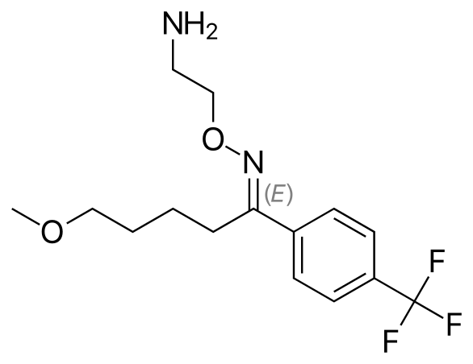

# Fluvoxamine-Model
Whole-body PBPK model of fluvoxamine. 

  

 

This repository contains:

- a PK-Sim snapshot (*.json) file of the current PBPK model
- static content (e.g. text blocks, *.md files) as inputs for an evaluation plan
- an evaluation plan (evaluation-plan.json) to create an evaluation report using the snapshot and static text blocks to display the performance of the model

**The latest release of the snapshot of the model, the evaluation plan and the static content can be found [here](../../releases/latest).**

**The latest release of the PK-Sim project model file and the respective evaluation report can be found [here](https://github.com/Open-Systems-Pharmacology/OSP-PBPK-Model-Library/releases/latest).**

Fluvoxamine is a selective serotonin reuptake inhibitor used to treat major depression and obsessive compulsive disorder. The U.S. Food and Drug Administration (FDA) recommends fluvoxamine as strong clinical CYP1A2 and CYP2C19 index inhibitor to evaluate the impact of CYP1A2/CYP2C19 inhibition on CYP1A2/CYP2C19 substrates. Furthermore, the fluvoxamine acts as weak to moderate CYP3A4 inhibitor.

The PBPK model of fluvoxamine includes its metabolism by CYP1A2 and CYP2D6 and its inhibitory effect on CYP1A2 and CYP3A4.

The presented model was developed by Britz et al. [[1](#References)].

## Code of conduct
Everyone interacting in the Open Systems Pharmacology community (codebases, issue trackers, chat rooms, mailing lists etc...) is expected to follow the Open Systems Pharmacology [code of conduct](https://github.com/Open-Systems-Pharmacology/Suite/blob/master/CODE_OF_CONDUCT.md#contributor-covenant-code-of-conduct).

## Contribution
We encourage contribution to the Open Systems Pharmacology community. Before getting started please read the [contribution guidelines](https://github.com/Open-Systems-Pharmacology/Suite/blob/master/CONTRIBUTING.md#ways-to-contribute). If you are contributing code, please be familiar with the [coding standard](https://github.com/Open-Systems-Pharmacology/Suite/blob/master/CODING_STANDARDS.md#visual-studio-settings).

## License
The model code is distributed under the [GPLv2 License](https://github.com/Open-Systems-Pharmacology/Suite/blob/develop/LICENSE).

## References
[1] [Britz H, Hanke N, Volz AK, Spigset O, Schwab M, Eissing T, Wendl T, Frechen S, Lehr T. Physiologically-Based Pharmacokinetic Models for CYP1A2 Drug-Drug Interaction Prediction: A Modeling Network of Fluvoxamine, Theophylline, Caffeine, Rifampicin, and Midazolam. CPT Pharmacometrics Syst Pharmacol. 2019 May;8(5):296-307.](https://doi.org/10.1002/psp4.12397)